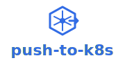

# Push-to-K8s Press Kit

Welcome to the Push-to-K8s press kit! This page provides official branding assets, logos, and guidelines for community members, bloggers, conference speakers, and anyone who wants to reference or promote Push-to-K8s.

---

## 📥 Quick Downloads

### Logos (SVG - Recommended)

All logos scale perfectly at any size. Right-click to download:

| Logo | Usage | Download |
|------|-------|----------|
|  | Primary logo for light backgrounds | [logo-full-color.svg](logos/logo-full-color.svg) |
|  | For dark backgrounds | [logo-reversed.svg](logos/logo-reversed.svg) |
|  | Square avatars, app icons | [logo-icon.svg](logos/logo-icon.svg) |
|  | Vertical/narrow spaces | [logo-stacked.svg](logos/logo-stacked.svg) |

**Need PNG?** See [Exporting PNG Images](#exporting-png-images) below.

---

## 🎨 Brand Colors

Use these colors when creating Push-to-K8s related content:

### Primary Colors

| Color | Hex | Preview | Usage |
|-------|-----|---------|-------|
| **Kubernetes Blue** | `#326CE5` |  | Primary brand color, logos, buttons |
| **Trust Navy** | `#1A2332` |  | Text, dark backgrounds |

### Accent Colors

| Color | Hex | Preview | Usage |
|-------|-----|---------|-------|
| **Success Green** | `#00C853` |  | Success states, checkmarks |
| **Warning Amber** | `#FFB300` |  | Warnings, caution |
| **Error Red** | `#D32F2F` |  | Errors, alerts |
| **Info Cyan** | `#00B8D4` |  | Information, tips |

---

## 📝 Project Description

### One-Line Description
> Automatically synchronize Kubernetes secrets across all namespaces with a single label

### Short Description (Tweet-sized)
> Push-to-K8s: Production-ready Kubernetes controller that syncs labeled secrets across all namespaces. Label once, propagate everywhere. Zero-config. #Kubernetes

### Full Description (Press Release)
> Push-to-K8s is an open-source Kubernetes controller that automatically synchronizes secrets from a source namespace to all other namespaces in a cluster. By simply labeling a secret with `push-to-k8s=source`, the controller ensures it's propagated and kept in sync across your entire cluster. Built for production use with comprehensive Prometheus metrics, health checks, and graceful shutdown handling. Perfect for distributing registry credentials, TLS certificates, API keys, and other cluster-wide secrets.

---

## 🎯 Key Messages

Use these talking points when presenting or writing about Push-to-K8s:

- **"Label once, propagate everywhere"** - Core value proposition
- **Production-ready** - Battle-tested with comprehensive observability
- **Zero-configuration** - Works out of the box with sensible defaults
- **Automatic synchronization** - Secrets update across all namespaces automatically
- **Namespace awareness** - New namespaces get secrets immediately
- **Built for reliability** - Prometheus metrics, health checks, graceful shutdown

---

## 🖼️ Logo Usage Guidelines

### ✅ DO

- Use the official logos without modification
- Maintain the original aspect ratio
- Ensure adequate contrast with the background
- Use the reversed (white) logo on dark backgrounds
- Provide clear space around the logo (equal to the height of "k" in wordmark)

### ❌ DON'T

- Don't stretch, rotate, or distort the logo
- Don't change the colors (use the provided variations instead)
- Don't add effects like shadows, gradients, or outlines
- Don't place the logo on busy backgrounds
- Don't use old or unofficial versions

### Minimum Sizes

- **Icon only**: 32px (digital) / 0.5 inches (print)
- **Wordmark**: 120px (digital) / 1.5 inches (print)
- **Full logo**: 160px (digital) / 2 inches (print)

---

## 💬 Using the Name

### Official Name
**Push-to-K8s** (with capital P and K, hyphenated)

### Acceptable Variations
- push-to-k8s (lowercase, in code or CLI)
- Push to K8s (in casual writing)

### Avoid
- ~~Push to Kubernetes~~ (too long)
- ~~push2k8s~~ (incorrect spelling)
- ~~PushToK8s~~ (CamelCase - reserved for code identifiers)

---

## 📱 Social Media

### Profile Images
Use `logos/logo-icon.svg` - the square icon version works perfectly as an avatar.

### Cover Images
Create custom banners using:
- Logo: `logos/logo-full-color.svg` or `logos/logo-reversed.svg`
- Background: `#326CE5` (Kubernetes Blue) or `#1A2332` (Trust Navy)
- Tagline: "Automatically synchronize Kubernetes secrets"

### Hashtags
`#PushToK8s` `#Kubernetes` `#K8s` `#CloudNative` `#CNCF`

### Handles
- GitHub: [@supporttools/push-to-k8s](https://github.com/supporttools/push-to-k8s)

---

## 📸 Screenshots

> **Coming Soon**: Product screenshots, terminal demos, and dashboard examples.

In the meantime, here's example usage:

```bash
# Label a secret as source
kubectl label secret my-secret push-to-k8s=source -n source-namespace

# Verify it synced to all namespaces
kubectl get secrets my-secret --all-namespaces
```

---

## 🎤 Presentations & Talks

### Slides
When presenting about Push-to-K8s:
- Use the logo on your title slide
- Include the project description
- Link to the GitHub repository
- Mention it's open-source (MIT License)

### Demo Script
1. Show cluster with multiple namespaces
2. Create and label a secret in source namespace
3. Verify automatic sync to all namespaces
4. Create a new namespace and show immediate sync
5. Show Prometheus metrics

---

## 📰 Media & Blog Posts

### Press Inquiries
Contact: Matt Mattox (mmattox@support.tools)

### Linking
- Official Website: [github.com/supporttools/push-to-k8s](https://github.com/supporttools/push-to-k8s)
- Documentation: [github.com/supporttools/push-to-k8s/tree/main/docs](https://github.com/supporttools/push-to-k8s/tree/main/docs)

### Attribution
When writing about Push-to-K8s:
- Link to the GitHub repository
- Mention it's open-source
- Credit: "Push-to-K8s by Support Tools"

---

## 🎨 Exporting PNG Images

Our logos are provided as SVG (vector) files which scale perfectly. If you need PNG format:

### Online Converters (Easiest)
1. Go to [CloudConvert](https://cloudconvert.com/svg-to-png) or [SVG to PNG](https://svgtopng.com/)
2. Upload the SVG file
3. Set your desired width (e.g., 800px)
4. Download the PNG

### Using ImageMagick (Command Line)
```bash
# Install ImageMagick
brew install imagemagick  # macOS
apt-get install imagemagick  # Ubuntu/Debian

# Convert to PNG
convert logos/logo-full-color.svg -resize 800x logo-800w.png
```

### Recommended PNG Sizes
- **Social media avatars**: 400×400px
- **Blog post headers**: 800px wide
- **High-res displays**: 1200px wide
- **Print materials**: 300 DPI, appropriate physical size

---

## 📋 Badges

Add these badges to your README or documentation:

```markdown


```

**Preview:**


---

## 🤝 Community Guidelines

### Be Respectful
Push-to-K8s is an open-source project maintained by community members. Please be kind and respectful in all interactions.

### Share Your Work
Using Push-to-K8s in production? Wrote a blog post? Gave a talk? We'd love to hear about it!
- Open an issue or discussion on GitHub
- Tag us on social media
- Add your company to the "Who's Using" list

### Contributing
Want to improve Push-to-K8s? See our [Contributing Guide](../contributing/development.md).

---

## 📄 License

### Software License
Push-to-K8s is released under the [MIT License](https://github.com/supporttools/push-to-k8s/blob/main/LICENSE).

### Brand Assets License
The Push-to-K8s logos and brand assets are provided for use in accordance with these guidelines. Attribution is appreciated but not required.

You're free to use these assets to:
- Link to or discuss the Push-to-K8s project
- Promote your integration or usage of Push-to-K8s
- Create educational content about Push-to-K8s
- Include in presentations or conference talks

Please don't:
- Use the logo to imply official endorsement without permission
- Modify the logos or create confusingly similar logos
- Use the assets in a way that suggests affiliation without permission

---

## 📞 Contact

- **General Questions**: [GitHub Discussions](https://github.com/supporttools/push-to-k8s/discussions)
- **Bug Reports**: [GitHub Issues](https://github.com/supporttools/push-to-k8s/issues)
- **Press/Media**: Matt Mattox (mmattox@support.tools)
- **Contributing**: See [Contributing Guide](../contributing/development.md)

---

## 🔗 Additional Resources

- **[Documentation](../index.md)** - User guides and API reference
- **[GitHub Repository](https://github.com/supporttools/push-to-k8s)** - Source code
- **[Contributing Guide](../contributing/development.md)** - Development setup

---

**Last Updated**: October 2025
**Version**: 1.0

Thank you for your interest in Push-to-K8s! 🚀
